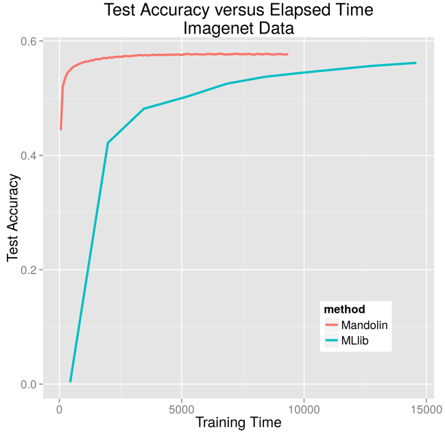

# Spark

Mandolin can utilize Apache Spark for large-scale learning tasks.  The
Spark-based APIs are present in the mandolin-spark artifact.  Largely
all of the Mandolin and Spark integration is encapsulated in Mandolin's
distributed stochastic gradient descent implementation. This means that
only minor changes to the configuration file and runtime invocation are
required, while the model specification and input formats do not change
from Mandolin's standalone mode.

Mandolin's distributed optimization strategy differs from MLlib's, and
consistently attains lower "time-to-best-accuracy" across a variety of
datasets and cluster configurations.  The figure below shows accuracy
curves for both Mandolin and MLlib on an Imagenet classification task.

## Distributed Online Repeated Model Averaging

Our primary approach to distributed training is based on distributed
online repeated model averaging (DORMA). This algorithm works by first
partitioning the data into disjoint or overlapping partitions,
performing online learning on each partition concurrently and
independently, then averaging the model parameters derived from each
partition into a single model.  The second and third steps can be
repeated many times in an iterative fashion.

Mandolin implements the DORMA algorithm by using two critical Spark
classes: RDDs and Broadcast variables.  The training data is read into
an RDD and partitioned such that only a single partition exists on each
Spark executor.  This is realized by forcing the number of partitions to
be equal to the number of executors, which should be equal to the number
of nodes on the compute cluster.

Optionally, each iteration can also involve repartitioning the data
across the cluster. This process is controlled by the `oversample`
parameter.

## MLLib Integration

